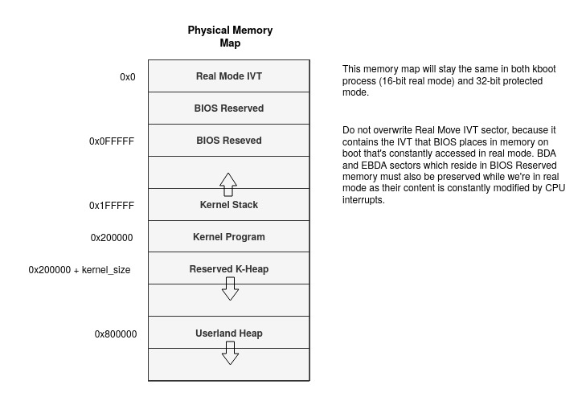
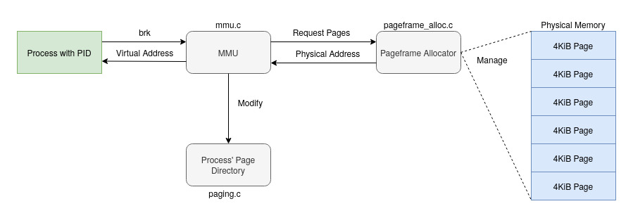
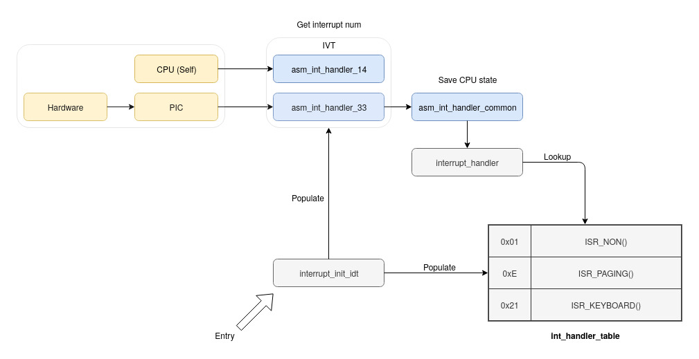
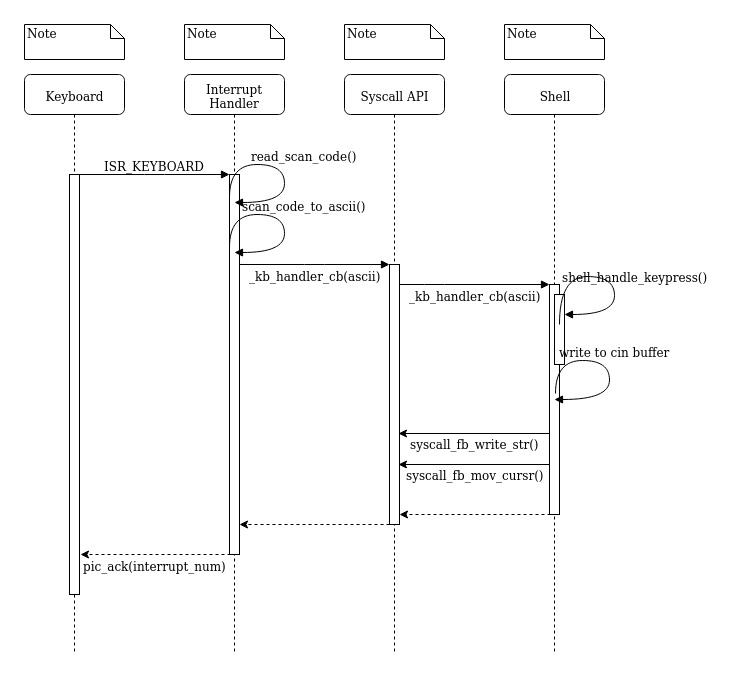

#### [Home](README.md)

- [4. Kernel](#4-kernel)
* [4.1 Memory](#41-memory)
    + [4.1.1 Detecting Memory's Limits](#411-detecting-memory-s-limits)
    + [4.1.2 Global Descriptor Table](#412-global-descriptor-table)
    + [4.1.3 Physical Memory Map](#413-physical-memory-map)
    + [4.1.4 Reserved Memory Space On x86](#414-reserved-memory-space-on-x86)
    + [4.1.5 Paging](#415-paging)
    + [4.1.6 Higher-Half Kernel](#416-higher-half-kernel)
    + [4.1.7 Memory Management Unit](#417-memory-management-unit)
* [4.2 Interrupts](#42-interrupts)
    + [4.2.1 Interrupt Descriptor Table](#421-interrupt-descriptor-table)
    + [4.2.2 Programmable Interrupt Controller](#422-programmable-interrupt-controller)
    + [4.2.3 Interrupt Handler Implementation](#423-interrupt-handler-implementation)
    + [4.2.4 Interrupts](#424-interrupts)
    - [4.2.4.1 Keyboard](#4241-keyboard)
    - [4.2.4.2 Pagefault](#4242-pagefault)
* [4.3 I/O](#43-i-o)
    + [4.3.1 stdin](#431-stdin)
* [4.4 Scheduler](#44-scheduler)

## 4. Kernel

### 4.1 Memory
#### 4.1.1 Detecting Memory's Limits
- BIOS keeps a record of types of RAM.
- Thus BIOS can detect the type of RAM installed and its features.
- Because BIOS is in ROM, it can mess with RAM without consequences.
- So we ask BIOS for info on RAM.
- At the moment, we use multiboot info header to get memory upper and lower limits.
#### 4.1.2 Global Descriptor Table

#### 4.1.3 Physical Memory Map

#### 4.1.4 Reserved Memory Space On x86

#### 4.1.5 Paging

- With Paging enabled, when a memory address is deferenced, x86 goes to the Paging Directory
to look for the corresponding Page Table that manages 4MiB of the physical memory region.
- Once paging is enabled, everything must use paging, including the kernel (even interrupts).

```
// 2nd Page Table is looked up (because each Page Table manages 4MiB), 
// then 4 bytes at offset 0x100000 in the Page Table is set to 0x2.
int *p = 0x500000;
*p = 0x2;
```
#### 4.1.6 Higher-Half Kernel
- Because a user program always assumes it owns all the memory. All compiled programs starts 
at 0x0 in virtual memory, so we should place the kernel somewhere else so they don't overlap.
- With a lot of linker and paging-on-boot hacking, we place the kernel at 0xc0000000 (3GiB).
- From now on, all absolute physical addresses must add 0xc0000000 to its address (e.g. the VGA 
buffer must be at 0xc00b8000 instead of 0x000b8000). Everything that requires physical address 
to work must also be translated before passed in as arguments(e.g. the Page Directory in paging_init).
- All future user programs may easily make system calls as the kernel is in their address space.

```
higher_half_init() -> kboot() -> kmain() -> paging_init()
```

#### 4.1.7 Memory Management Unit
Virtual Memory Layout of a user program


Memory Allocator

- We use a bitmap to keep track of which physical memory pages are available. 1 bit represents 1 page (4KiB).
- Allocating a new page will take O(n) time, modifying a page will take O(1) time.


### 4.2 Interrupts
#### 4.2.1 Interrupt Descriptor Table

#### 4.2.2 Programmable Interrupt Controller

- All hardware interrupts must go through the PIC (ATA, keyboard, etc.).
- All CPU-generated interrupts do not go through the PIC.
#### 4.2.3 Interrupt Handler Implementation

#### 4.2.4 Interrupts
##### 4.2.4.1 Keyboard
- When a key is pressed, the keyboard sends an interrupt to the PIC, which is then sent to the CPU.
The interrupt number is 0x1, plus the PIC offset (0x20 in our case) becomes 0x21.
- When we receive this interrupt, the ISR must read the scan code from the keyboard port, then translate
this scan code into ascii code.
- Both key presses and key releases generate interrupts. If we hold down a key, interrupts will keep 
getting triggered.

PS/2:
```
Key press-> keyboard controller recognizes press -> sends interrupt to CPU
```
vs USB:
```
Key press -> keyboard controller recognizes press -> stores keypress until USB poll -> sends status to USB controller -> USB controller sends interrupt to CPU
```

##### 4.2.4.2 Pagefault
- This is an exception, which is a kind of interrupt.
- The CPU generates this to interrupt itself, thus pagefault interrupt will not go through the PIC.
- After paging is enabled, when an unmapped memory address is dereferenced, the CPU generates a pagefault interrupt.
- We should translate this into a segmentation fault signal.

### 4.3 I/O
#### 4.3.1 stdin


How the shell uses syscall to handle keyboard input and screen output



Sequence diagram on what happens when a key is pressed

PS/2:
```
Key press-> keyboard controller recognizes press -> sends interrupt to CPU
```
vs USB:
```
Key press -> keyboard controller recognizes press -> stores keypress until USB poll -> sends status to USB controller -> USB controller sends interrupt to CPU
```

### 4.4 Scheduler
