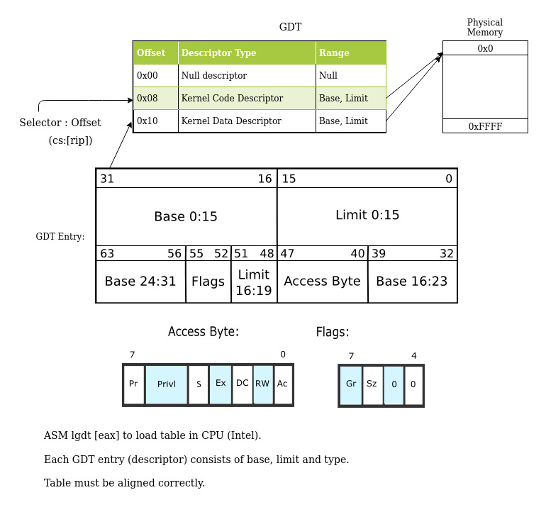
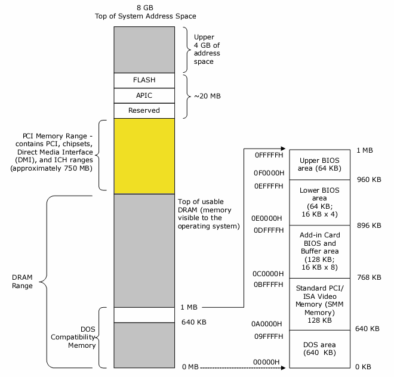

#### [Home](README.md)
## 4. Kernel

### 4.1 Memory
#### 4.1.1 Detecting Memory's Limits
- BIOS keeps a record of types of RAM.
- Thus BIOS can detect the type of RAM installed and its features.
- Because BIOS is in ROM, it can mess with RAM without consequences.
- So we ask BIOS for info on RAM.
#### 4.1.2 Global Descriptor Table

#### 4.1.3 Physical Memory Map

#### 4.1.4 Reserved Memory Space On x86

#### 4.1.5 Paging

- With Paging enabled, when a memory address is deferenced, x86 goes to the Paging Directory
to look for the corresponding Page Table that manages 4MiB of the physical memory region.

```
// 2nd Page Table is looked up (because each Page Table manages 4MiB), 
// then offset 0x100000 in the Page Table is set to 0x2.
int *p = 0x500000;
*p = 0x2;
```
#### 4.1.6 Memory Management Unit
TODO

### 4.2 Interrupts
#### 4.2.1 Interrupt Descriptor Table

#### 4.2.2 Programmable Interrupt Controller

#### 4.2.3 Interrupt Handler Implementation


### 4.3 Scheduler
